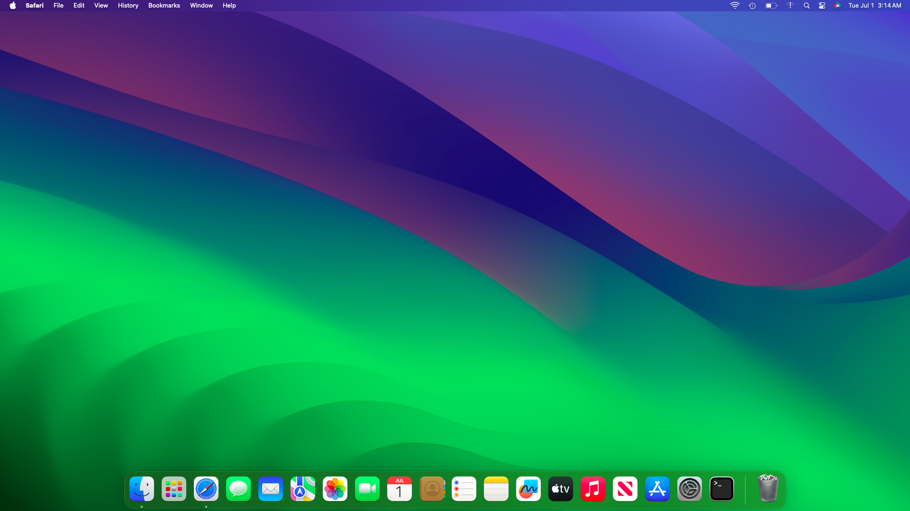

# HP-Pavilion-x360-14-Hackintosh

A repo for installing macOS Sonoma on HP Pavilion x360 14 using OpenCore.

# Laptop's Hardware 
- <b>CPU</b>: [Intel i5 10210U](https://www.intel.co.id/content/www/id/id/products/sku/195436/intel-core-i510210u-processor-6m-cache-up-to-4-20-ghz/specifications.html) Quad-Core CPU 2.1Ghz (Comet Lake-U)
- <b>GPU</b>: Intel UHD 630 Graphics 
- <b>Storage</b>: 512GB WD SN520 NVME PCIe SSD
- <b>RAM</b>: 16 GB DDR4 2666MHz
- <b>Screen</b>: 14-inch FHD (1920 x 1080)
- <b>Trackpad</b>: SYNAPTICS SYNA328b (I2C)
- <b>Wi-Fi</b>: Intel Wireless Dual-Band AX201 (Upgraded)
- <b>Ports</b>: 1 x USB-C, 2 x USB 3.0,USB 2.0 SD Card Reader, HDMI Display Port

# Overview 

# What's Working?
Everything Works except for the boot chime (may look more into it)

# What's Not Working?
Touchscreen (Had to be disabled so fingerprint works good) and Fingerprint

# Bugs
- None found so far!

# BIOS Configuration
Make sure to disable secure boot and your good to go!

# Credits
- [Apple](https://www.apple.com) for macOS.
- [Acidanthera](https://github.com/acidanthera) for most of the kexts.
- [RehabMan](https://github.com/RehabMan) for some ACPI patches.
- [Steve Zheng](https://github.com/stevezhengshiqi) for some patches.
- [zhen-zen](https://github.com/zhen-zen) for YogaSMC.
- [Hiep Bao Le](https://github.com/hieplpvip) for AppleBacklightSmoother
- [Sniki](https://github.com/Sniki) for some patches.
- [daliansky](https://github.com/daliansky) for some ACPI patches.
- [Moh_Ameen](https://github.com/ameenjuz) for some ACPI patches.
- [blackosx](https://github.com/blackosx/OpenCanopyIcons) for OpenCanopyIcons theme.
- [al3xtjames](https://github.com/al3xtjames) for clover-theme-oss theme.
- [ImmersiveX](https://github.com/ImmersiveX) for clover-theme-minimal-dark theme.
- And anyone else that helped to develop and improve hackintoshing.
